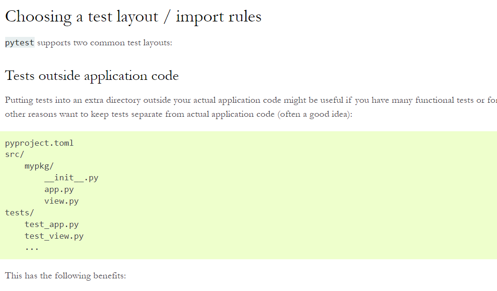

- note we dont necessarily need test files to start with "test", we can run the same with `pytest tests/mytest.py`

- note , the function we are using to test, should also start with `test_add()`

- https://docs.pytest.org/en/7.2.x/explanation/goodpractices.html

- note we need to pass `-s` to see the print statements
- `pytest -v -s` -> will also print the print statements in the function

- `pytest -s -v --disable-warnings .\tests\test_users.py` to disable warnings

- how to make pytest stop executing other tests as soon a first failure occurs?
    - `pytest -v -x` - > `-x` makes it stop